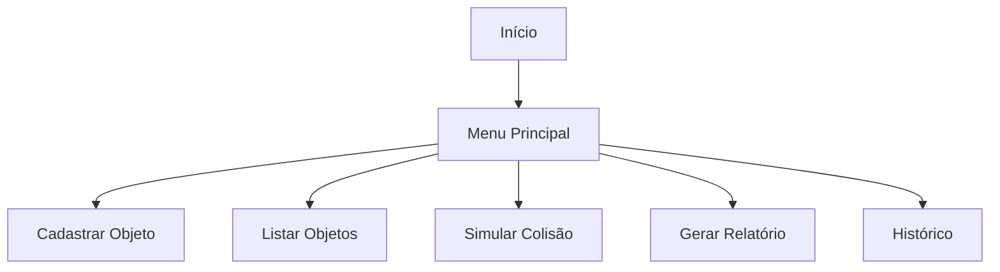

# SpaceMonitor

## Motivação

O SpaceMonitor é uma aplicação console em C# criada para a Global Solution da FIAP. O projeto simula uma central de monitoramento espacial capaz de registrar objetos em órbita, listar informações operacionais, avaliar riscos simples de colisão e manter um histórico de eventos.

## Problema do lixo espacial

O lixo espacial é formado por restos de satélites, fragmentos de colisões, estágios de foguetes e outros detritos que permanecem em órbita terrestre. Esses objetos podem atingir velocidades muito altas e representar risco para satélites ativos, missões tripuladas, estações espaciais e infraestrutura crítica de comunicação, navegação e observação da Terra.

## Solução proposta

O sistema permite cadastrar satélites, detritos espaciais e estágios de foguetes com dados orbitais básicos. A central calcula uma simulação simples de risco de colisão: quando dois objetos possuem diferença de altitude inferior a 50 km, um alerta preventivo é emitido e registrado no histórico.

## Arquitetura utilizada

O projeto foi organizado por camadas e responsabilidades:

- `Models`: entidades do domínio espacial.
- `Interfaces`: contratos de serviços.
- `Services`: regras de monitoramento, alerta e relatório.
- `Structs`: tipos de valor usados pelo domínio.
- `Exceptions`: exceções customizadas.
- `Reports`: classe parcial de relatório.
- `Data`: armazenamento em memória do histórico de eventos.

A aplicação utiliza injeção de dependência via construtor entre os serviços, reduzindo acoplamento direto e facilitando manutenção.

## Conceitos de POO aplicados

- Programação Orientada a Objetos com entidades e serviços.
- Encapsulamento em propriedades com setters privados.
- Herança a partir da classe abstrata `ObjetoEspacial`.
- Polimorfismo ao percorrer uma coleção de `ObjetoEspacial` e executar `ExibirInformacoes()`.
- Classe abstrata com método abstrato.
- Interface `IMonitoramento`.
- Injeção de dependência via construtor.
- Tratamento de exceções com `try/catch`.
- Exceções customizadas.
- `struct` `CoordenadaOrbital`.
- `partial class` `Relatorio`.
- Uso de `DateTime` para registros e histórico.
- Métodos pequenos e modularizados.

## Estrutura de pastas

```text
SpaceMonitor
├── Models
│   ├── ObjetoEspacial.cs
│   ├── Satelite.cs
│   ├── DetritoEspacial.cs
│   └── EstagioFoguete.cs
├── Interfaces
│   └── IMonitoramento.cs
├── Services
│   ├── MonitoramentoService.cs
│   ├── AlertaService.cs
│   └── RelatorioService.cs
├── Structs
│   └── CoordenadaOrbital.cs
├── Exceptions
│   ├── ObjetoNaoEncontradoException.cs
│   └── AltitudeInvalidaException.cs
├── Reports
│   ├── Relatorio.Part1.cs
│   └── Relatorio.Part2.cs
├── Data
│   └── HistoricoEventos.cs
├── Program.cs
├── SpaceMonitor.csproj
└── README.md
```

## Como executar o projeto

Pré-requisito: .NET SDK 8 instalado.

```bash
dotnet restore
dotnet build
dotnet run
```

## Funcionalidades

- Cadastrar satélite.
- Cadastrar detrito espacial.
- Cadastrar estágio de foguete.
- Listar objetos espaciais de forma polimórfica.
- Simular risco de colisão por diferença de altitude.
- Emitir alertas preventivos.
- Gerar relatório consolidado.
- Exibir histórico de eventos com data e hora.

## Tecnologias utilizadas

- C# 12
- .NET 8
- Console Application
- Programação Orientada a Objetos
- Mermaid para documentação visual

## Fluxo da aplicação


